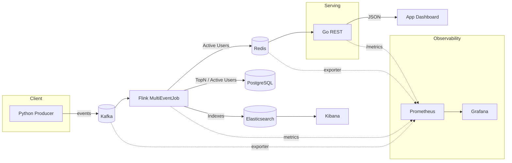

<div align="center">

# CartPulse · Real‑Time E‑commerce Analytics

Streaming analytics with Flink + Kafka + Redis + Postgres + Elasticsearch · Observability via Prometheus + Grafana · REST by Go

</div>

---

## Contents
- Overview
- Architecture
- Repo Layout
- Prerequisites
- Quick Start
- Flink Job (details + env)
- Go API
- Observability
- DR & Replay
- Troubleshooting

---

## Overview
CartPulse ingests user events from Kafka, computes real‑time metrics in Apache Flink, serves low‑latency results from Redis and durable aggregates from PostgreSQL, and indexes data in Elasticsearch for search/visualization. A Go REST API exposes metrics to dashboards; Prometheus + Grafana provide system‑level observability.

Key metrics
- Active Users (5‑minute sliding window)
- Hourly Top‑N Products (by amount)
- Abandoned Cart Detection (no checkout within 30 minutes)

Reliability & Ops
- At‑least‑once + idempotent upserts (PG) / overwrite (Redis/ES)
- Flink checkpoints, restart strategy, RocksDB backend, savepoints
- Replay via configurable Kafka start offsets (latest/earliest/timestamp)
- Prometheus + Grafana dashboards for Kafka/Flink/Redis/API/Node


## Architecture




## Repo Layout
```
SalesDateGenerator/        # Python Kafka producer (Faker)
FlinkEcommerce/            # Flink job (Java, Maven)
  └─ MultiEventJob.java    # Routing + Active Users + TopN + Abandoned Cart, sinks to Redis/PG/ES
api/                       # Go REST API
prometheus/prometheus.yml  # Prometheus scrape config
docker-compose.yml         # Kafka/Postgres/ES/Kibana/Redis/exporters/Prom/Grafana/API
```


## Prerequisites
- Docker Desktop (with Compose)
- Java 11/17 + Maven
- Flink 1.18.x (local, WSL/Linux) to submit the job
- Python 3.10+ (producer), Go 1.22+ (if running API locally)


## Quick Start

1) Infrastructure (Docker)
```bash
docker compose build api
docker compose up -d
```
Sanity checks
```bash
docker exec -it broker kafka-topics --bootstrap-server broker:29092 --list
docker exec -it redis redis-cli PING
psql -h localhost -U postgres -d postgres -c "select 1"
curl -s http://localhost:9200
curl -s http://localhost:8080/healthz
# UIs: Prometheus http://localhost:9090, Grafana http://localhost:3000
```

2) Flink metrics for Prometheus
Append to `$FLINK_HOME/conf/flink-conf.yaml`:
```properties
metrics.reporters: prom
metrics.reporter.prom.class: org.apache.flink.metrics.prometheus.PrometheusReporter
metrics.reporter.prom.port: 9249-9251
```
Enable reporter JAR and restart:
```bash
cp $FLINK_HOME/opt/flink-metrics-prometheus-*.jar $FLINK_HOME/lib/
$FLINK_HOME/bin/stop-cluster.sh && $FLINK_HOME/bin/start-cluster.sh
```
If Flink runs on WSL, set Prometheus `flink` targets to the WSL IP (e.g. `172.x.x.x:9249, :9250`) in `prometheus/prometheus.yml`, then:
```bash
docker compose restart prometheus
```

3) Create Postgres tables (one‑time)
```sql
CREATE TABLE IF NOT EXISTS active_users_minute (
  minute_ts TIMESTAMP PRIMARY KEY,
  users BIGINT
);
CREATE TABLE IF NOT EXISTS top_products_hourly (
  hour_ts TIMESTAMP,
  product_id TEXT,
  amount DOUBLE PRECISION,
  PRIMARY KEY(hour_ts, product_id)
);
```

4) Build & run Flink job
```bash
cd FlinkEcommerce && mvn -q -DskipTests package
BOOTSTRAP_SERVERS=localhost:9092 \
  $FLINK_HOME/bin/flink run \
  -c FlinkEcommerce.MultiEventJob \
  target/FlinkEcommerce-1.0-SNAPSHOT-shaded.jar
```
Replay options
```bash
# Start from earliest
KAFKA_START_MODE=earliest ...
# Start from timestamp (epoch ms)
KAFKA_START_MODE=timestamp KAFKA_START_TIMESTAMP_MS=1698739200000 ...
```

5) Start producer
```bash
pip install -r SalesDateGenerator/requirements.txt
BOOTSTRAP=localhost:9092 TARGET_RPS=100 python SalesDateGenerator/main.py
```

6) Verify outputs
Redis
```bash
docker exec -it redis redis-cli HGET cartpulse:metrics active_users_5m
docker exec -it redis redis-cli ZREVRANGE cartpulse:top_products_hourly:<yyyyMMddHH> 0 -1 WITHSCORES
docker exec -it redis redis-cli GET cartpulse:abandoned_carts_count
```
PostgreSQL
```sql
select * from active_users_minute order by minute_ts desc limit 5;
select * from top_products_hourly order by hour_ts desc, amount desc limit 20;
```
Elasticsearch (HTTP)
```bash
curl -s 'http://localhost:9200/active_users_minute/_count'
curl -s 'http://localhost:9200/top_products_hourly/_search?size=10&sort=hour_ts:desc'
```
Go API (http://localhost:8080)
```text
GET /metrics/active_users_5m
GET /metrics/top_products_hourly?hour=<yyyyMMddHH>
GET /metrics/abandoned_carts/count
```
Prometheus & Grafana
```text
Import dashboards: Kafka 7589, Flink 12523, Redis 763, Node 1860
```


## Flink Job (MultiEventJob)
Highlights
- Event‑time routing (5s out‑of‑orderness)
- Active Users 5m (slide 1m) → Redis hash + PG upsert + ES index
- Hourly Top‑N (sum amount) → Redis ZSET + PG upsert + ES index
- Abandoned cart (proc‑time timer; default 30m) → Redis list + counter
- Checkpoints + restart strategy; Kafka start offsets for replay

Env vars
| Variable | Default | Notes |
|---|---|---|
| `BOOTSTRAP_SERVERS` | `localhost:9092` | Kafka bootstrap |
| `KAFKA_START_MODE` | `latest` | `latest`/`earliest`/`timestamp` |
| `KAFKA_START_TIMESTAMP_MS` | — | Used when mode=`timestamp` |
| `ABANDONED_TIMEOUT_MINUTES` | `30` | Abandoned cart timeout |
| `REDIS_HOST` / `REDIS_PORT` | `localhost` / `6379` | For Redis sinks |


## Go API
Run via Docker
```bash
docker compose up -d api
```
Env
| Variable | Default | Notes |
|---|---|---|
| `BIND_ADDR` | `:8080` | HTTP bind |
| `REDIS_ADDR` | `redis:6379` | Use `localhost:6379` when running locally |
| `METRICS_ADDR` | `:2112` | Prometheus endpoint `/metrics` |

Endpoints
```text
GET /metrics/active_users_5m
GET /metrics/top_products_hourly?hour=<yyyyMMddHH>
GET /metrics/abandoned_carts/count
```


## Observability
Prometheus scrapes (`prometheus/prometheus.yml`)
- Flink reporter (use WSL IP + ports if needed)
- Kafka exporter (`kafka_exporter:9308`)
- Redis exporter (`redis_exporter:9121`)
- Go API (`api:2112`)
- Node exporter (`node_exporter:9100`)

PromQL cheatsheet
- `sum by (topic, group) (kafka_consumergroup_lag)`
- `flink_taskmanager_job_task_operator_numRecordsOutPerSecond`
- `rate(redis_commands_processed_total[1m])`
- `go_goroutines`


## DR & Replay
- Checkpoints: every 10s; set RocksDB + externalized checkpoints in `flink-conf.yaml`
- Restart strategy: fixed delay (3x, 10s)
- Savepoints: `flink savepoint <JOB_ID> file:///.../flink-savepoints` → `flink run -s <path> ...`
- Kafka replay: `KAFKA_START_MODE=earliest` or `timestamp` + `KAFKA_START_TIMESTAMP_MS`
- Idempotency: PG upsert PK, Redis overwrite/ZSET replace, ES stable `_id`